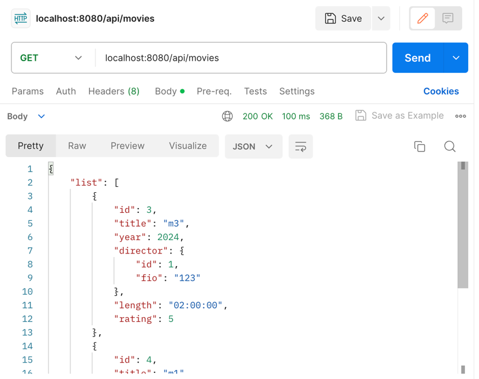
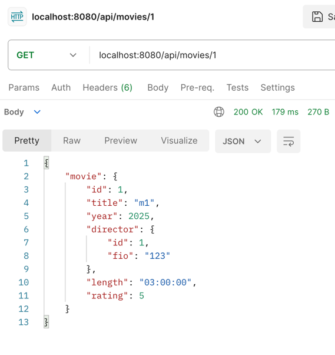
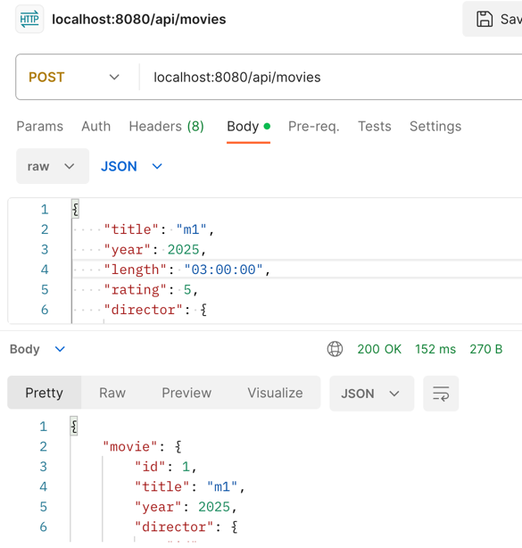
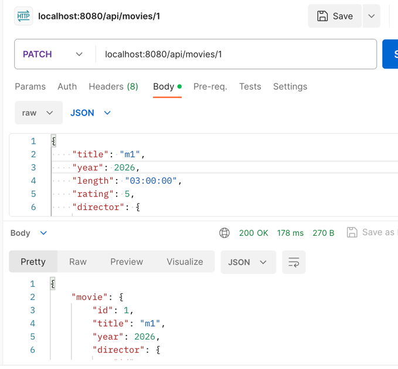
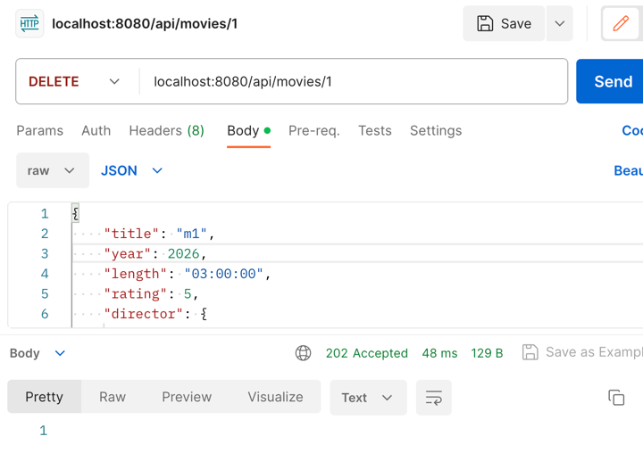
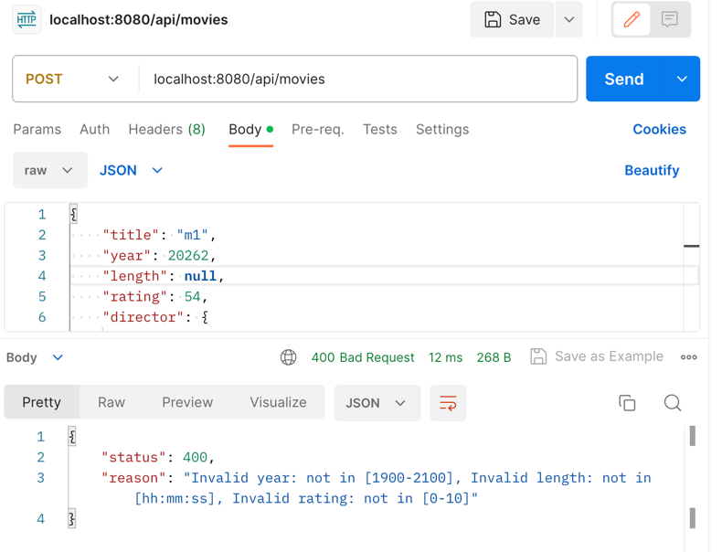
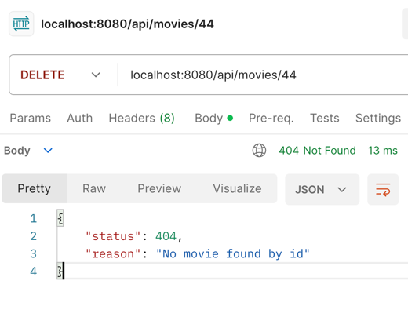
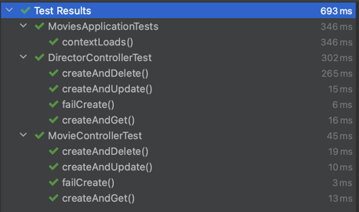

Крыжанков Степан Сергеевич

Сервис создания и получения фильмов и директоров

Эндпоинты для фильмов:

- GET /api/movies
 
- Получение всех фильмов
  

- GET /api/movies/{id}
  
  Получение фильма по id
  

- POST /api/movies
  
  Создание фильма
  

- PATCH /api/movies/{id}

  Обновление фильма
  

- DELETE /api/movies/{id}

  Удаление фильма
  

Аналогичные эндпоинты для директоров:
- GET /api/director
- GET /api/director/{id}
- POST /api/director
- PATCH /api/director/{id}
- DELETE /api/director/{id}

Обработка ошибок и хэндлинг исключений:
- Пример 400

Причем все ошибки конкатенируются и видны все неправильно заполненные поля
- Пример 404

Конфигурация в файле пропертей:
- Порт приложения

  server.port=8080
- БД

  spring.datasource.url=jdbc:postgresql://localhost:5432/movies
  spring.datasource.username=postgres
  spring.datasource.password=postgres

Тесты на весь функционал:
- com/itmo/movies/controller/DirectorControllerTest.java
- com/itmo/movies/controller/MovieControllerTest.java

